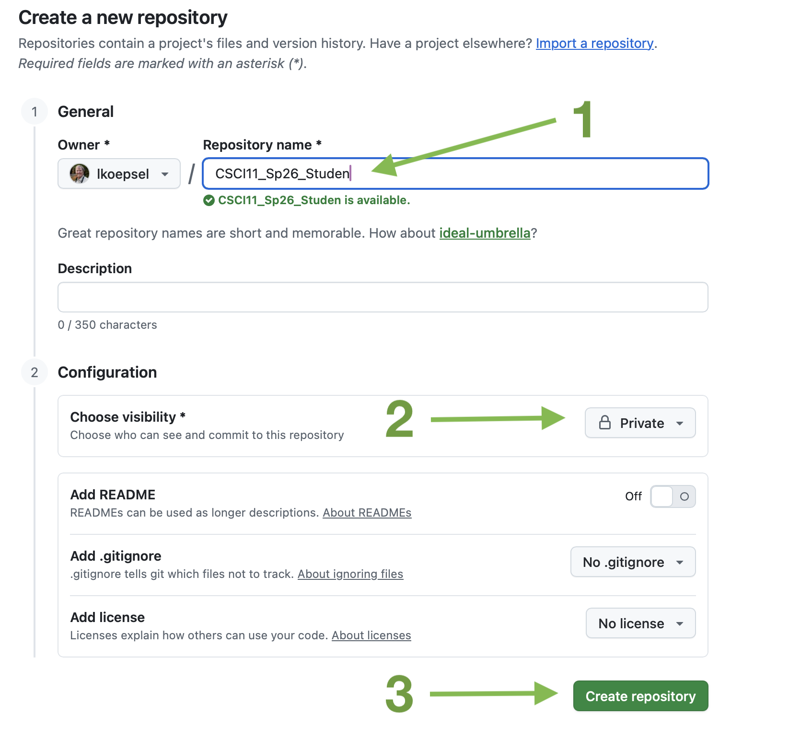

# Github Documentation for CSCI11 Spring 2026


## Important
Repositories for students to exchange homework with the instructor.

For *CSCI11 Spring 2026*, there are **two** repositories:
* *[CSCI11_Sp26_Instructor](https://github.com/lkoepsel/CSCI11_Sp26_Instructor)* - one repository, which will be the same for **all** students. It is *public* and hosted on *github.com/lkoepsel*. It contains the assignments for each week.
* *[CSCI11_Sp26_Student](https://github.com/lkoepsel/CSCI11_Sp26_Student)* - a clone of this repository for **each** student, it will be private and hosted on *github.com/student_username*. It contains each student's work on the weekly assignments.

### PLEASE NOTE:
1. **Please make sure your version of the student repository (*CSCI11...Student*) on GitHub is private and is accessible by only the instructor and you.**
2. **Please do NOT make changes or add files to the *CSCI11...Instructor* folder, as this is where you will receive new versions of files from the instructor**

## Installation

### 1. Clone this repository

1. Go to the [CSCI11_Sp26_Student](https://github.com/lkoepsel/CSCI11_Sp26_Student) on my github.
2. Click on the Green Code button. *See green arrow.*
3. CLick on the double boxes at the end of the "*git@github....*" *See blue arrow*.
. 
4. In a terminal session in VS Code, enter `git clone ` and paste the address following the word *clone*, ensuring there is a space between *clone* and the address. Press *return*.
5. Enter `cd CSCI11_Sp26_Student` to enter the directory.

### 2. Create your **remote** repository in your **Github** account.

   1. **In your Github account**, make sure your are logged in and click on Repositories, then click the green button New.
   

   2. Fill in the name of the repo to be exactly the same as the one you have cloned: CSCI11_Sp26_Student
   *Note, I left off the "t" for the image, otherwise I'd have an error,*
   Be sure to make the repository Private, all other boxes will stay the same then click on the green button Create Repository
   


### 3. Connect your **local** repository to your **Github** repository.

Perform the four commands below, **one by one**, ensuring there is **NOT** an error, before going to the next step:
   1. Remove the original connection, if the result is "*error: No such remote: origin*", this is fine:
```bash
git remote remove origin
```

   2. Add the origin which will point to *your* GitHub account, so you will **need to change username**:

```bash
git remote add origin git@github.com:username/CSCI11_Sp26_Student.git
```

   3. Add the branch, *main*:
```bash
git branch -M main
```

#### Important: For Step 4 to be successful, two things must be true:
1. You must have successfully [added your public key](./ssh.md) to your settings on github. Confirm with `ssh -T git@github.com`
2. Your origin must be correct. Confirm with `git remote -v` and it must respond with:
```bash
origin  git@github.com:studentname/CSCI11_SP26_Student.git (fetch)
origin  git@github.com:studentname/CSCI11_SP26_Student.git (push)
```

   4. Push the local branch *main* to your Github repository:
```bash
git push -u origin main
```

   5. You will need to configure your name and email address before attempting to commit any changes to your repository. Be sure to change the email address to your address and the name to your name.

```bash
git config --global user.name "John Doe"
git config --global user.email johndoe@example.com
```

## Ongoing Operations:

### To get the latest assignment, in the CSCI11_Instructor folder
   1. To **sync** with *lkoepsel* (or class) updates:
   ```bash
   git pull
   ```

   2. To **update** your work on GitHub:
   - Be sure to use the week-specific folders in the ```student``` folder then commit and push to your repository using VS Code Source Control or Terminal:
   ```bash
   git add -A # to add (stage) all of the changes
   git commit -m "adding my changes for week 5" # to commit your changes
   git push # to push your change to your repository on GitHub
   ```

## Overview

Your folder structure must be the following:
1. Repository Structure:
   - Your top folder (*Documents, below*), might be *Desktop*, *OneDrive*, *MyDocuments* or something else.
```
Documents/
├── CSCI11_Sp26_Instructor/ (Assignment repository)
│   ├── C/
│   ├── Digital_Design/
│   ├── LC3/
│       ├── week_5/
│       ├── week_6/
│   └── README.md
│   └── .gitignore
├── CSCI11_Sp26_Student/.  (Homework repository)
│   ├── C/
│   ├── Digital_Design/
│       ├── week_2/
│       ├── week_3/
│   ├── LC3/
│       ├── week_5/
│       ├── week_6/
│   └── C/
│   └── README.md
│   └── .gitignore
```


## Assignments for CSCI11 Computer Architectures

The content in CSCI11 will cover three areas:
* Digital Design
* LC3 Assembly Language
* C Language

In this repository are three folders, which are labeled appropriately for the content. The weekly assignments will be placed in folders labeled by week in the appropriate content, looking similar to this:

```
CSCI11_Student/
    ├── digital_design/
        |── week2
        |── week3
    ├── LC3/
        |── week5
        |── week6
    └── C/
        |── week10
        |── week11
```

## Links

* [Great resource on Git](https://git-scm.com/book)
